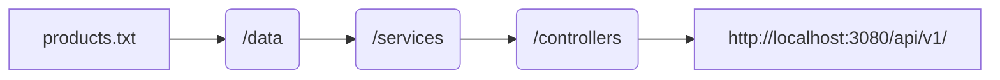
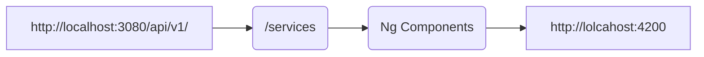

# From Hero to Superhero: Steady, ready, GO!
## Practice Exercise
To practice what we've learned in the course, the idea is to take everything we've done so far and: 
1.  Create a REST API with [Express](https://expressjs.com/) that implements the **GET**, **POST**, **PATCH**, and **DELETE** methods of a product list.
2. Internally, the products must be saved in a **.txt** file to ensure data persistence, even if the application is restarted.

### Specifications
★ When making a **GET** request to the endpoint `/api/v1/products/`, it should return the entire list of existing products.
★ When making a **POST** request to the endpoint `/api/v1/products/`, it should create the product and return the created product with its assigned unique identifier.
★ When making a **PATCH** request to the endpoint `/api/v1/products/{id}`, it should modify the product and return the product with all its created data.
★ When making a **DELETE** request to the endpoint `/api/v1/products/{id}`, it should delete the product and return a message saying: "*product {productName} was deleted*", for example: "*product hat was deleted*".
★ Products must have a unique identifier, name, long description, price, available units, and category.

> **Optional**
> ★ You can add middleware to validate the data format.
> ★ For this, we recommend installing a library called [Joi](https://www.digitalocean.com/community/tutorials/how-to-use-joi-for-node-api-schema-validation) which allows you to validate a structure of **JSON** objects.
> ★ When the validation fails, you must respond with an error status code, and when the validation passes, it should work as described above.

## Project Implementation
|        |URL             |PORT|COMMAND        |
|--------|----------------|----|---------------|
|Backend |http://localhost|3080|`npm run dev`  |
|Frontend|http://localhost|4200|`npm run start`|

### Project definition

